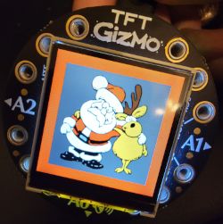

# Circuit Playground  Ornament
This is a simple Circuit Playground ornament inspired by this [Adafruit Learn Guide](https://learn.adafruit.com/circuit-playground-tft-gizmo-snow-globe). It's a fairly simple design built around a Circuit Playground Bluefruit and a TFT Gizmo.

## Hardware
- [Circuit Playground Bluefruit](https://learn.adafruit.com/adafruit-circuit-playground-bluefruit)
- [TFT Gizmo](https://learn.adafruit.com/adafruit-tft-gizmo)
- [Ornament](https://www.adafruit.com/product/4036)
- [LiPoly battery](https://www.adafruit.com/product/1578)

## Usage
The A button turns on the display.   
The B button turns off the display.   
Turn the ornament upside down for 3 seconds, and the display turns off.  
