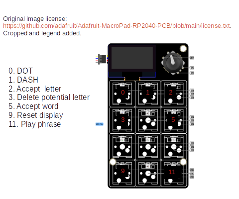

# Morse Code Macropad
This is a Circuit Python project using an [Adafruit Macropad](https://learn.adafruit.com/adafruit-macropad-rp2040). A macropad with the supplied [code.py](code.py) will allow the user to type dots and dashes to create letters & numbers in the International Morse code alphabet. One key is reserved to play back the results of user input using the built in Macropad speaker. 

# Button function

# Libraries to reproduce (Version 7.x Bundle)
See [requrirements.txt](requirements.txt) for libraries to reproduce. Code written uses CircuitPython 7.x