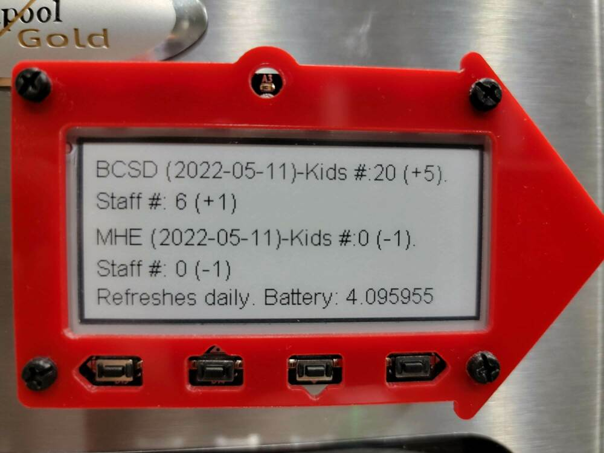

# Daily Covid Track 
Daily Covid Track is a project for the [Adafruit Magtag](https://www.adafruit.com/product/4800?gclid=CjwKCAjw7IeUBhBbEiwADhiEMSQJlZ-fxF7MuCYifAMYkGkHlUbZlsfZMCLBWnU-ualMz6IqMhUIwxoCi2QQAvD_BwE) using CircuitPython. It is tied to another Github project, [BCSD COVID Track](https://github.com/packdl/bcsd-covid-dashboard). BCSD Covid Track generates a [JSON file](https://github.com/packdl/bcsd-covid-dashboard/blob/main/output/dailydifference.json) of daily COVID numbers along with the delta from the previously recorded day. 

## What the final project does
The Daily Covid Track project pulls the JSON file, and creates a display of the school districts COVID data and an elementary school's data. It also provides the delta from the previously recorded day.  The display sleeps after pulling the JSON file for 24 hours. This conserves power. My personal instance has been operating for weeks between charges. 

## What the final project looks like
 

# Libraries to reproduce (Version 7.x Bundle)
- adafruit_bitmap_font
- adafruit_display_text
- adafruit_io
- adafruit_magtag
- adafruit_portalbase
- adafruit_fakerequests.mpy
- adafruit_il0373.mpy
- adafruit_miniqr.mpy
- adafruit_requests.mpy
- adafruit_slideshow.mpy
- neopixel.mpy
- simpleio.mpy

# Outcome
1. A Magtag 
2. COVID data on the magtag
